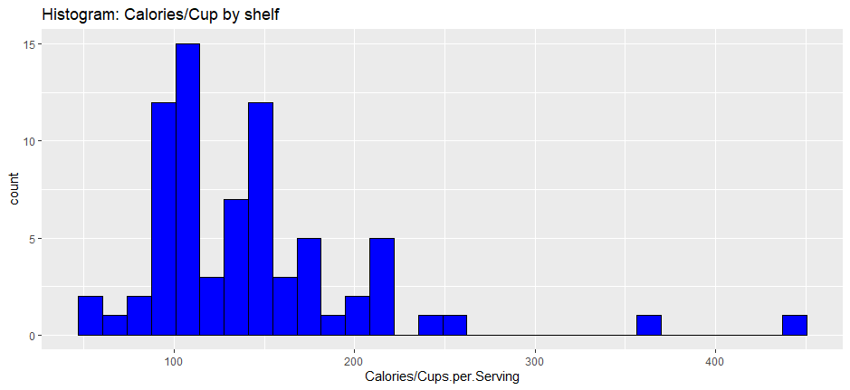
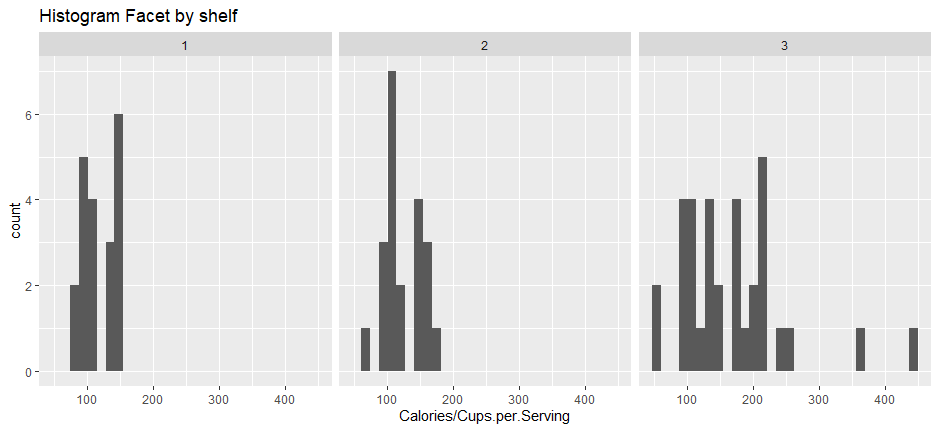
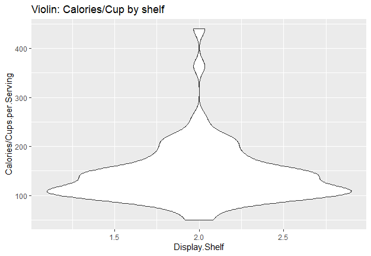
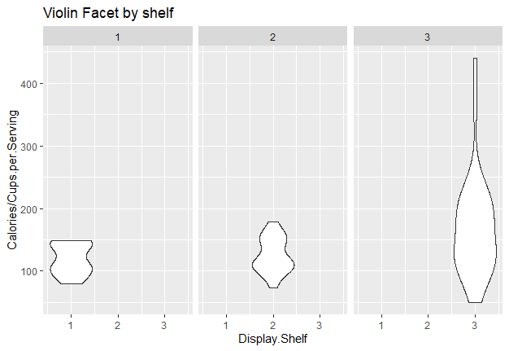

D3
==

Using the d3 requires to install the library:

Html will run the whole css, d3 and more.

R:
==

library(ggplot2)

df \<- read.csv("data/cereal.csv")

For replacing negative values I’ve used the following:

df[df\<0] \<- 1

**Histogram of calories_per_cup (computed element) **

Code:

ggplot(data=df,aes(x=Calories/Cups.per.Serving))+ggtitle("Histogram:
Calories/Cup by shelf")+geom_histogram(colour='black',fill="blue")

**Histogram of calories_per_cup  faceted by Shelf**

**Code**: h+facet_wrap(\~Display.Shelf,nrow=1)+ggtitle('Histogram Facet by
shelf') + scale_fill_gradient(low="blue")

Violin

v
\<-ggplot(data=df,aes(x=Display.Shelf,y=Calories/Cups.per.Serving))+ggtitle("Calories/Cup
by shelf")+geom_violin()

v+facet_wrap(\~Display.Shelf,nrow=1)+ggtitle('Violin Facet by shelf')

