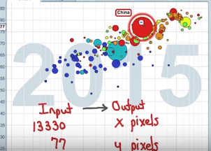
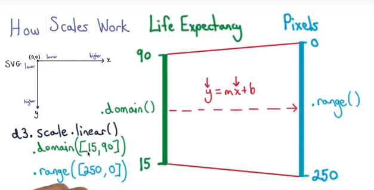
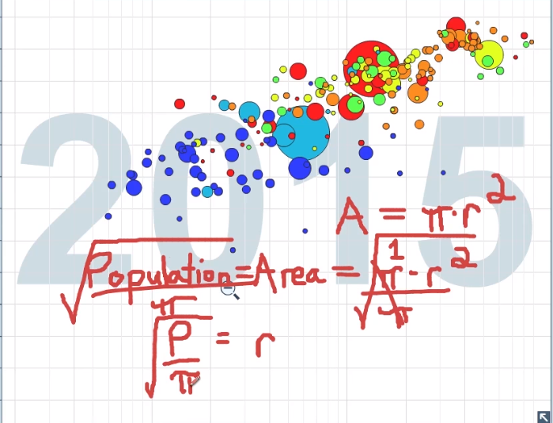
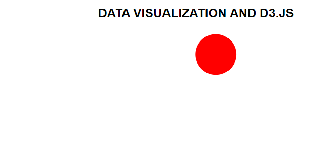

D3
==

Using the d3 requires to install the library:

Html will run the whole css, d3 and more.

Goal is to replicate the famous Gapminder scatter plot to D3:

How scales work  

Step 0: find a beautiful CSS And HTML page, remove the unncessaries with:

d3.select('.main').html("");

Step 1: Add SVG brah!

var svg = d3.select('.main').append('svg');

svg.attr('width',600).attr('height',300);

Step 2 Mapping the scalse:

Adjust the height

\#life expense (15-90 ) To 250-0

var y = d3.scale.linear().domain([15,90]).range([250,0]);

y(15):0

\#Quiz: GDP per capita : 250- 100,000

var x = ?

Answer :

var x = d3.scale**.log().**domain([250,100000]).range([0,600]);

x(100000):600

Step 3: Drawing the circles (r)

var r = d3.scale.sqrt().domain([52070,1390000]).range([10,40]);

r(1300000):48

Now lets check if all the points are working:

console.log(y(77),x(13338),r(1380000))

**43**.333333333333314 **398**.25769816993596 **49**.821260992838134

svg.append('circle').attr('fill','red').attr('r',r(1380000)).attr('cx',x(13330)).attr('cy',y(77));

Japan:

1.  Paste contents of d3.min.js file into console.

2.  File can be found [here](https://d3js.org/d3.v3.min.js).

3.  Expected Output: True

4.  Clear content from div in course viewer: Input: d3.select('.main').html('');

5.  Expected Output: \>[Array[1]]

6.  Define svg variable: Input: var svg = d3.select('.main').append('svg')

7.  Expected Output: undefined

8.  Assign y axis linear scale to y variable. This axis describes life
    expectancy. Note that while the height of the svg is 300 pixels, only 250
    are used for the y axis to leave a buffer. Also, for the y axis the max
    value comes first because of a quirk with how objects are drawn in the
    browser: highest value at bottom of axis. Input: var y =
    d3.scale.linear().domain([15,90]).range([250,0]);

9.  Expected Output: undefined

10. Assign X axis scale to x variable. This axis describes annual income.
    Input: var x = d3.scale.log().domain([250,100000]).range([0,600]);

11. Expected Output: undefined

12. Assign radius scale to r variable. The radius corresponds to the square root
    of the population. Input: var r = d3.scale.sqrt().domain([52070,
    1380000000]).range([10, 50]);

13. Check scaling with console.log by plugging in life expectancy for China in y
    variable, and annual income per person for China in x variable, and
    population for China in r variable. Input: console.log(y(77), x(13330),
    r(1380000000));

14. Expected Output appox: 43.33333333333314 398.1976156961321 50

15. Append circle with attribute values for radius, fill color, center x and
    center y of circle: Input: svg.append('circle').attr('r',
    r(1380000000)).attr('fill','red').attr('cx', x(13330)).attr('cy', y(77));

16. Expected Output: \>[Array[1]]

17. Look at placement of the circle in the svg, and compare with the placement
    in the original Gapminder World graph: <http://www.gapminder.org/world/>

R:
==

library(ggplot2)

df \<- read.csv("data/cereal.csv")

For replacing negative values I’ve used the following:

df[df\<0] \<- 1

**Histogram of calories_per_cup (computed element) **

Code:

ggplot(data=df,aes(x=Calories/Cups.per.Serving))+ggtitle("Histogram:
Calories/Cup by shelf")+geom_histogram(colour='black',fill="blue")

Last

**Histogram of calories_per_cup  faceted by Shelf**

**Code**: h+facet_wrap(\~Display.Shelf,nrow=1)+ggtitle('Histogram Facet by
shelf') + scale_fill_gradient(low="blue")

HistogramFacedbyShelf

Violin

v
\<-ggplot(data=df,aes(x=Display.Shelf,y=Calories/Cups.per.Serving))+ggtitle("Calories/Cup
by shelf")+geom_violin()

v+facet_wrap(\~Display.Shelf,nrow=1)+ggtitle('Violin Facet by shelf')

C:\\Users\\as630696\\AppData\\Local\\Microsoft\\Windows\\INetCache\\Content.Word\\Violing
by shelf.png

